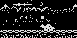

# Tamaguino-AB
A port of Alojz Jakob’s Tamaguino for the Arduboy Games System

To Do or Add or Changes made:

Move to Arduboy2 Library --Done
Remove Wire + SPI Stuff  --Done
Convert & relocate Images  --Done
Edit Speaker pin  --Done
Framerate too fast  --Done
Better handling for audio - Maybe Arduboy Beep
Improve Button Handling
OLED Sleep
More intereaction
Improved Power saving

# Tamaguino
Tamagotchi clone for Arduino

https://alojzjakob.github.io/Tamaguino/
